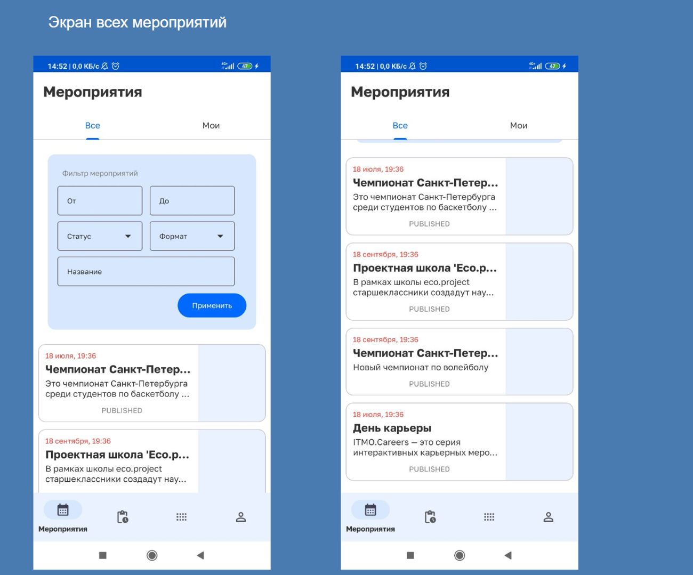
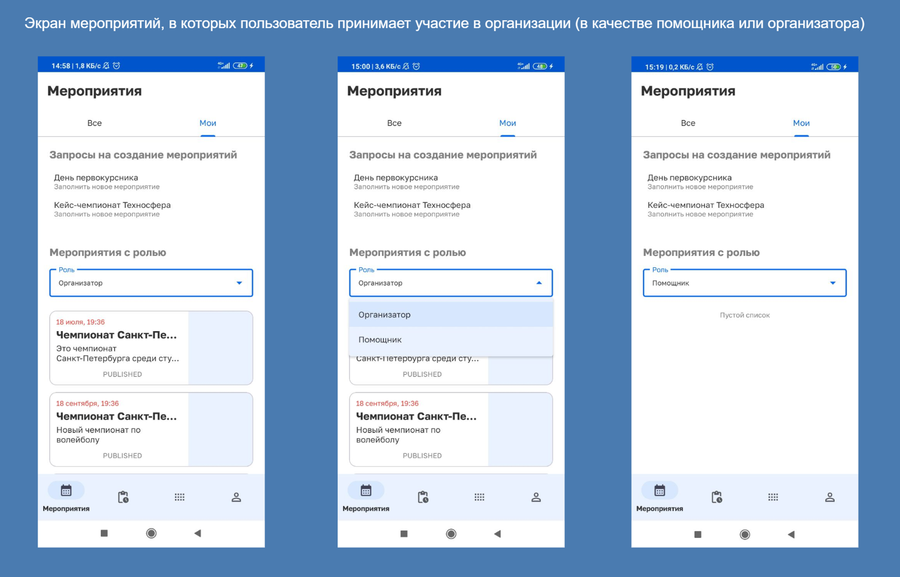
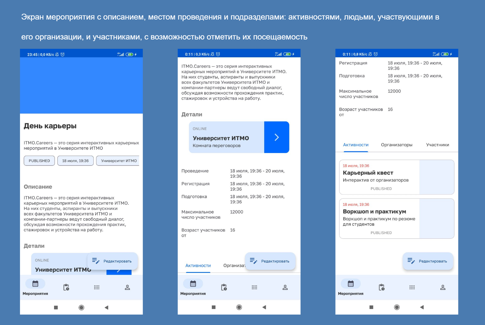
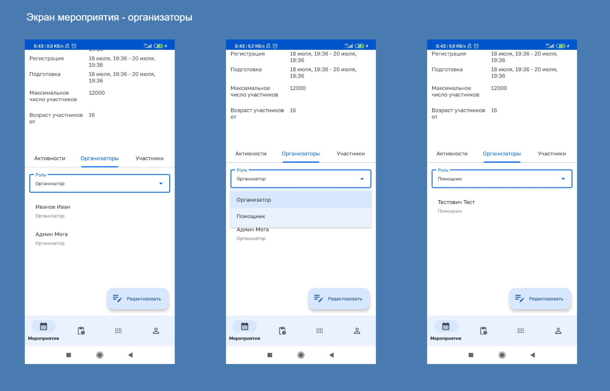
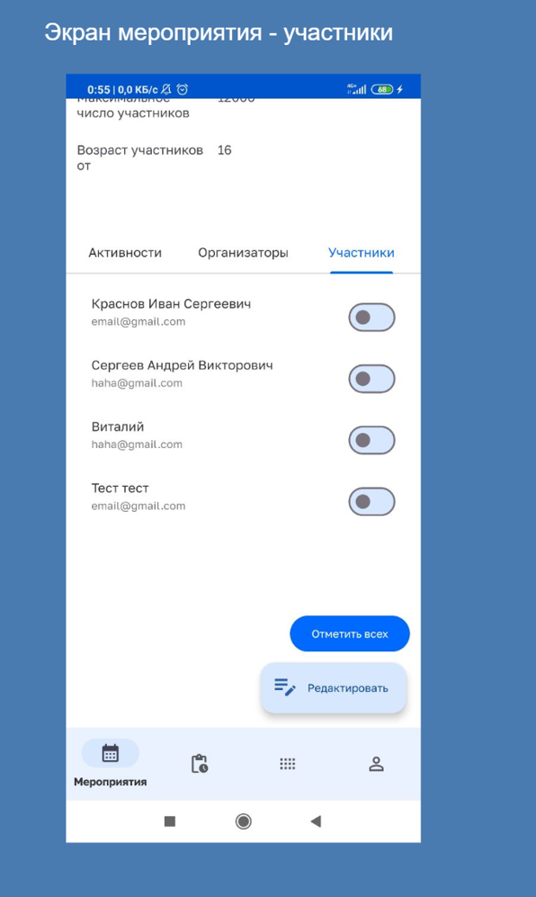
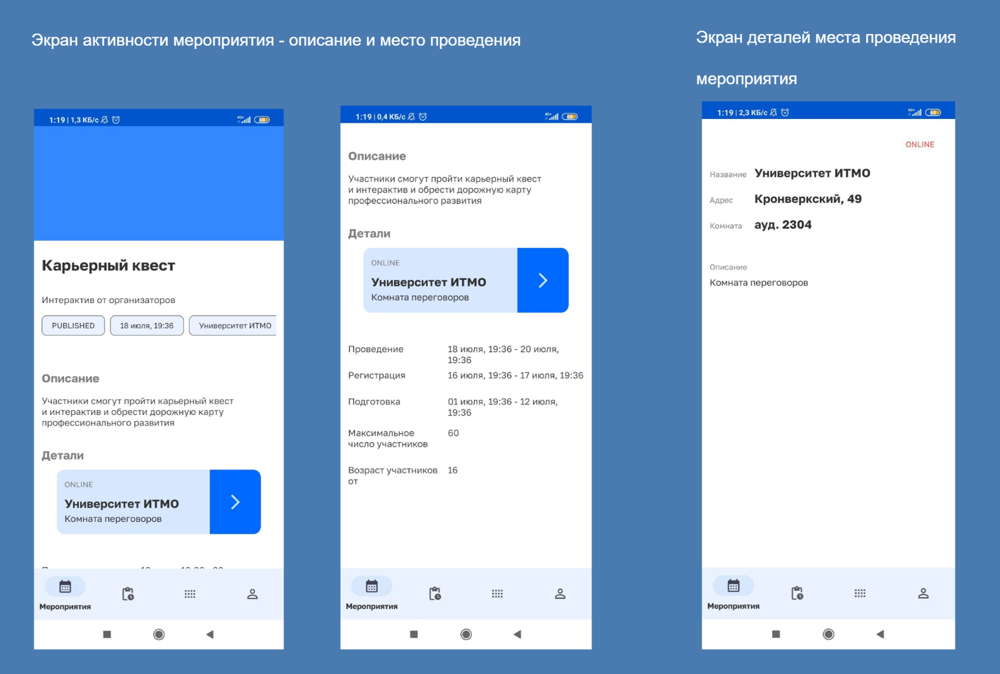

# ITMO Event App

Приложение для организации мероприятий в Университете ИТМО.
Позволяет организаторам просматривать проводимые мероприятия,
изменять их и принимать участие в их организации и проведении. Организаторы могут брать на себя задачи и далее выполнять их, обновляя статус.
Система будет уведомлять пользователя при достижения дедлайна выполняемой задачи и других событиях.
Некоторые из функций приложения доступны только при условии наличия у пользователя нужной привилегии, иначе на экране они скрыты.

Этот проект частично реализуется в качестве дипломной и практической работы.

## Стек технологий

* Kotlin
* ViewModel, LiveData
* Fragments, FragmentManager
* Retrofit
* Material 3

## Архитектура

* Используется архитектура Single Activity c Fragments и FragmentManager.
* Слой представления использует Views для отображения элементов интерфейса и ViewModel, контролирующее состояние экрана. Каждому экрану (фрагменту-активити) соответствует по отдельному ViewModel.
* Элементы интерфейса обновляют свое состояние через подписки на liveData.
* Слой данных содержит репозитории и сетевые интерфейсы в качестве источника данных (Retrofit). Здесь же представлены модели данных.

## Фото интерфейса (рабочее состояние)

  
 
  
 
  
 
  
 
  
 
  

  

## Статус

В процессе добавления новых функций

* добавление раздела задач мероприятия
* добавление формы создания и редактирования мероприятия и других сущностей системы
* добавление пуш уведомлений

## API

Приложение обращается к серверной части системы

